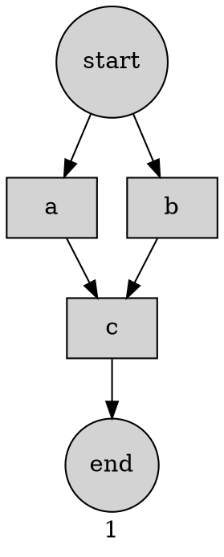

# FLOWER 

## About 

FLOWER is an Acronym for:

> [Flow][E]ngine For [R]eal Time

Flower attempts to bridge the gap between structured approach to back-end development
via DSL and externalisation of business logic from core execution.


Caution:

This aims to reduce the number of developers required to run a business, not to increase it.
So, trade carefully. May be it is not the tool you are looking for.


## Objective


### 'API' development 

From the last decade the cult of "api-development" has become synonymous with the following:

1. Exposing data over web ( CRUD )
2. Aggregating multiple other API calls or data sources ( Aggregation )
3. Writing next to trivial logic ( apparently called *business logic* ) 
4. All of these w/o any inherent capability of parallelism, asynchrony and timeouts and retries ( resiliency ) 

In the end business and tech needs diverge : where it is like a self fulfilling circle
culminating into throttling business development. 

### Reduce Developer Footprint 

The previous paragraph suggests ( many ) wrong ideas about the nature of the Tech.
All of these has to stop, or has to be done by folks who are not even developers.
Software development must be democratised beyond developers.
If something was possible with 100 developers, then those MUST be solved with 10, if not less.


Goal of any development must starts with profit, and end with increasing margin.
This cannot happen with an empire full of developers doing development for development's sake.
A crack team of 10 is more than capable of handling a top team of 100 developers.


And we should stop thinking about "long run". In the long run, the business will be more than dead.

### Stable Standard by Default  

What we are saying is anti thesis of what the so called "Industry Experts" promote.
Perhaps they know better, perhaps they mean well. That is not to say that we are willing to sacrifice stability.

Some code in some form is unavoidable, no matter how differently one represents it.
Consider the goal of query. In 1960s it was COBOL and then SQL became a stable standard.
With the advent of *scale* people almost stopped using SQL - instead started using SQL-ish dialect which are DSLs.

Inventing DSL is key. So DSL it is. 
Kubernetes/Ansible popularised YAML and hence Yaml form is chosen for visual representation.

## Design Goals

1. Business Logic outside Code 
2. Configurability with Turing Completeness 
3. Polyglot Environment 
4. Reduction of Development cost 
5. Get shit done

One paragraph suffices for each of them.

### Separation of Business from Core Engine 

Key issue of loss of dev time is logic is inside code.
This must be separated with *logic from business people* against *core logic to do anything*.
The *functional* stuff helped , a bit.

### Turing Completeness along with Configuration Based 

At most a business need must be Turing Complete. 
Also, given the separation of logic - one must build a configuration based engine.

### Everyone Wins - Polyglot

The snob attitude of one language is *better than another* must stop.
Given any problem there are sub problems and within them one language must trump others.
Massive data processing ? Perhaps you need Pandas. We do not know. 

Hence the system must support a large class of languages in which people can type in random code for business.
Hence, one does not need to find a specific set of developers - let's call them *business developers* with specified tech.

### Reduction of Development Cost

Previous paragraph reduces the development bar. *Stellar* is less than the operating word.
Imagine SQL. The people building SQL would be very less, 10 or less even.
Folks who would be using SQL to get something done would be in millions.

One does not need to reach that much margin, but a ratio of 1 core Engineer per 10~50 *business developer* is good enough.
Most of the cases they can be contractual employees.

Cost reduction immediately follows.

### Get Shit Done

As discussed, every work item must transform into in less than 3 steps how it is going to either:

1. Reduce Cost 
2. Increase Profit 

Goal for this, then is to ensure result in any way necessary. 


## Basic Idea 

Any program is a workflow, API development is more so.
Thus the basic idea is given a business requirement create a configuration based flow out of it, 
then run it via a real time workflow engine.

### Flow Basics

The executable unit for any computation is a flow.
Flower runs a flow.

#### Node

These are the atomic unit of a flow.  
A node must have a body to be executed, a guard condition - failing which the node will not be executed,
and a list of dependant nodes, after successful completion of them *ONLY* the node would be executed.

#### Graph

The structure above creates a directed  graph structure for the flow. 
Thus given a graph structure, multiple flows can be embedded in it, defining a set of *PATH* culminating in
a single node in the graph.

#### Flow 

Hence, given a graph, and a node, Flower backtracks to find suitable flow to run that node.

#### Example

```yaml
name: 'example graph'
nodes:
  a:
    body: a
  b:
    body: b
  c:
    body: a + b
    depends:
      - a
      - b
```

This produce the following graph:



Which is the precise flow from `start` to the `end`.
Way to call it is given by:

```java
Map<String,Object> params = new HashMap<>();
params.put("a", 10 );
params.put("a", 20 );
String path = .... ; // path to the workflow
String node = "c" ; // node to reach  
DependencyWorkFlow workFlow = MapDependencyWorkFlow.MANAGER.load(path);
Map<String,Object> result = MapDependencyWorkFlow.MANAGER.run(workFlow, node, params);
assertEquals(30, result.get("c"));

```

### Engine 

Flower engine executes the flow.


#### Algorithm

Input : node name, parameter values.

1. Get parameters and populate memory
2. Given the node name
   
   2.1. check if all dependencies are satisfied
   
   2.2. if not, find each of the unsatisfied dependencies and repeat from [2]
   
   2.3. if yes, then execute body. 
3. If the current node is the input node and we did execute - HALT.
4. Else - recurse.  


#### Computation Primitives  

1. Memory : Mutable Map is being used. Each node creates a variable of the same name where their output is stored.
2. Execution : Multithreaded - gets executed in a thread-pool, thus parallel processing is default.
3. Timeout : Execution of individual nodes as well as the whole flow is time bound 
  

#### Scripting 

For expression and programming support JSR-223 languages are used.
The default is JavaScript - and it use ZoomBA to handle many internal operations.


## Manual 


### Node 

Comes in 3 varieties.

#### Basic 

```yaml
# this is a basic node 
i_am_a_node: # that is my name 
  when : true # guard block 
  body : 42 # this is how you specify the body function  
  depends: # my dependencies 
    - another_node 
    - more_node 
```

##### when 

Guard block.
A node will only execute when the guard condition is true.

##### body 

Body of the computation.
The result of this expression/script will be stored as the result for the node
in the compute memory.

##### depends 

Set of dependencies for the node, w/o whom the node execution would be meaningless.
This is how the dependency graph gets created.

#### Web

This is used to make web calls, ( `HTTP` ).

```yaml

get_all_comments:
  https: # protocol 
    url: "#{base}/comments" 
    verb: get

```

For these nodes `http` and `https` protocols are supported.
`url` defines the url for the web call while `verb` defines the `HTTP` verb to use.

#### Fork 

This node used to distribute a sub-graph ( a node ) for parallel execution.

```yaml
  distribute:
    fork :
      node: dummy_node
      var : some_id
      unique : false
    depends:
      - gen_fork

  dummy_node:
    body: >
      some_id ** 2 
```
As one can see the term `fork` distinguishes a fork node.

##### depends 

Only one dependency, the node it depends upon must produce a collection of sorts to distribute the work.
In this regard dependency is the `data source` for the fork node, and the `mapper` in the `map-reduce` paradigm.

##### node

That is the target reachable node, the `exec` node for the fork. Engine will isolate the subgraph to reach into the `node`
and then will run the sub-workflow in a separate isolated environment for each item in the data source.

##### var

The context variable name - which will be used to store the item coming from data source.

##### unique

If set to `true` collects the result of this fork operation in a `Set`. Default is `false` so it stores it in a `List`.


### Scripting 

Given JSR-223 is included, all JVM scripting languages are default supported, default provided are `javascript` and ZoomBA `zmb`.
One can use various script engine in various nodes although that would be a terrible experience.
The engine support is described as follows:


```yaml
engine: zmb
```

Default support are `zmb` for `ZoomBA`, `js`, `javascript` for JavaScript. 

It is recommended to use ZoomBA, because it was developed for business development ( see wiki in references ).

#### Redirection

One can use inline script, or can reference a script file.
For example this is how one can reference the file `large_enough.zm ` stored in the same folder as that of the yaml file.

```yaml
 body: "@_/large_enough.zm"
```
Notice the trick `@_/` before the file name. This gets replaced by the `folder` of where the yaml file is situated. 
This is very useful to copy the whole workflow source code as is.


### Graph Structure 

A typical Yaml Structure for a Graph is shown here:

```yaml
name: 'gather_chatty_users'
engine: zmb

params:
  LARGE_WORDS : int

constants:
  base : "jsonplaceholder.typicode.com"

nodes:

  get_all_comments:
    https:
      url: "#{base}/comments"
      verb: get

  select_large_post_ids:
    body: "@_/large_enough.zm"
    depends: 
      - get_all_comments

```
As we can see `name` is the name of the workflow.
`engine` is the default script engine to be used, if no one else specifies anything else.

#### constants 

`constants` is a special map which stores all things constant that can be used to dereference later.
They are available to every node and script as values.

#### params

This defines the parameters for the flow.
Engine checks if each parameter is filled in before the engine runs a flow.
Same is applicable for each node.

See the tests to understand more. 


## Other Interesting Ideas

1. Rule Engines ( [https://en.wikipedia.org/wiki/Business_rules_engine](https://en.wikipedia.org/wiki/Business_rules_engine) )
2. Workflow Engines (  [https://en.wikipedia.org/wiki/Workflow_engine](https://en.wikipedia.org/wiki/Workflow_engine) ) 
3. Low Code (  [https://en.wikipedia.org/wiki/Low-code_development_platform](https://en.wikipedia.org/wiki/Low-code_development_platform) )
4. DSL ( [https://en.wikipedia.org/wiki/Domain-specific_language](https://en.wikipedia.org/wiki/Domain-specific_language)  )
5. ZoomBA ( [https://gitlab.com/non.est.sacra/zoomba/](https://gitlab.com/non.est.sacra/zoomba/) )


Here is my own presentation on DSL :  
[https://www.slideshare.net/nogamondal/formal-methods-in-qa-automation-using-dsl](https://www.slideshare.net/nogamondal/formal-methods-in-qa-automation-using-dsl)


Unfortunately, the tech clan is dead against using any of them which does not allow them to write code, 
and clutter the whole business logic out of it.
Hence, while some of these sounds like great ideas, they are very less samples of it in production.


## License 

This work is under Apache 2.0.
Here is from where one get a copy:
[https://www.apache.org/licenses/LICENSE-2.0.txt](https://www.apache.org/licenses/LICENSE-2.0.txt)
