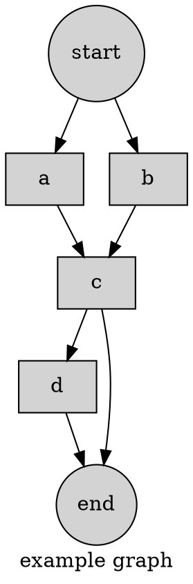
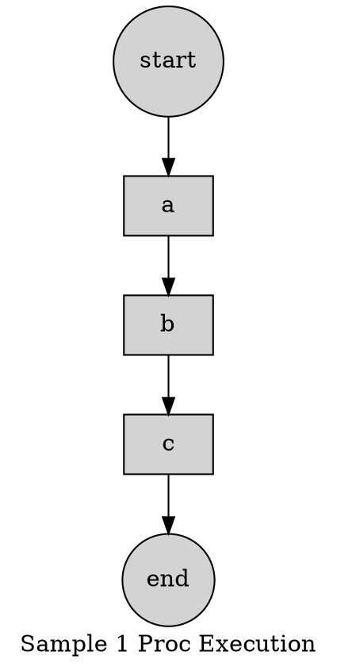
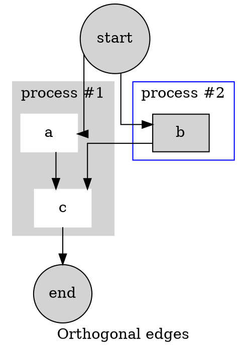

# FLOWER 


## Table of Contents 

```toc
```

[toc]


## About 

FLOWER is an Acronym for:

> *FlowE*ngine For *R*eal Time processing needs

Flower attempts to bridge the gap between code-it-all approach to back-end development
versus externalisation of business logic from core execution via DSL. 

It is a general purpose, polyglot, configuration driven, 
DSL based business flow engine designed to democratise backend development.

Caution:

This aims to *reduce the number of developers* required to run a business, not to increase it to create a tech empire.


## Objective


### 'API' development 

From the last decade the cult of "api-development" has become synonymous with the following:

1. Exposing data over web ( CRUD )
2. Aggregating multiple other API calls or data sources ( Aggregation )
3. Writing next to trivial logic ( apparently called *business logic* ) 
4. All of these w/o any inherent capability of parallelism, asynchrony and timeouts and retries ( performance & resiliency ) 

In the end business and tech needs diverged : where it is like a self fulfilling circle.
This throttles business development, this must be stopped. 

### Reduce Developer Footprint 

The previous paragraph suggests ( many ) wrong ideas about the nature of the Tech.
All of these have to be modelled such that these get done by few, while being used by many others who are not even developers. 

Software development must be democratised beyond developers.
If something was possible with 100 developers, then those MUST be solved with 10, if not less.

Goal of any development must start with profit, and end with increasing margin.
This cannot happen with an empire full of developers doing development for development's sake.
A crack team of 10 should be more than capable of handling a top team of 100 developers.

Excel Macros are such an example, so are SQL Engines.

And we should stop thinking about "long run". In the long run, the business will be more than dead.

### Following A Standard

What we are suggesting  is the very anti thesis of what the "Industry Experts" promote.
Perhaps they know better, perhaps they mean well. That is not to say that we are willing to sacrifice Quality - which means to us at-least : "write once, forget".

This does not mean never to look at the source code, it is about once it is written, there would be no need to look at it again and again because of maintenance. Can this be done in principle? Yes. Read on.

There will be parts of a flow which would almost never change, and there will be parts which will be frequently changing. First creates the core engine, second one creates the malleable *business logic*.

Code in some form is unavoidable, no matter how differently one represents it.
Consider the goal of query. In 1960s it was COBOL and then SQL became a stable standard.
With the advent of *scale* people almost stopped using SQL - instead started using SQL-ish dialect which are DSLs.

Inventing DSL is key. So DSL it is. 
Kubernetes/Ansible popularised YAML and hence Yaml form is chosen for  representation.

## Design Goals

1. Business Logic outside Code Repos 
2. Configurability with Turing Completeness 
3. Polyglot Environment  
4. Cost Reduction in Development 

One paragraph suffices for each of them.

### Separation of Business from Core Engine 

Key issue of loss of dev time today begins with *custom* logic residing inside code.
This must be separated. 
*logic from business people* should be kept separated from *core logic to do anything*.
To achieve this, *functional* style helps while 
*Declarative* style does it better.

### Turing Complete Configuration Language

A business need at most must be computable, hence describable in a Turing Complete language. 
Given the separation of logic - one must build a configuration based engine.
This prompts creation of a DSL that is configuration based, but Turing Complete as well.

Such a DSL is not new. The T-SQL completion of SQL as well as Gradle is Turing Complete.
Incidentally both are *declarative* in nature:

```gradle
apply plugin: 'java'

repositories {
   jcenter()
}

dependencies {
   compile 'org.slf4j:slf4j-api:1.7.12'
   testCompile 'junit:junit:4.12'
}

jar {
   manifest {
      attributes 'Main-Class': 'com.example.main.Application'
   }
}
```

It is inconceivable why business logic never became declarative in last 10 years which saw incredibly processor speed improvements.


### Polyglot -  Everyone Wins 

The DSL in use must have scripting and language injection support.

Given any problem there are sub problems and within them one language may trump others
in terms of applicability into the domain.

Hence the system must support a fairly large class of languages in which people can type in *unavoidable* code for business.

Such code *must* be kept few and far between. For all practical purpose, they should be indistinguishable from writing declarative expressions.

Henceforth, one does not need to find a specific set of developers : let's call them *business developers* with specified tech.

### Reduction of Development Cost

Previous section raises the bar for *Engine Development* and reduces the development bar for *Business Development* . 

Imagine SQL. The people building SQL would be very less, 10 or less even.
Folks who would be using SQL to get something done would be in millions.

One does not need to reach that much margin, but a ratio of 1 core Engineer per 10~50 *business developer* is good enough.
Most of the cases they can be contractual employees.

Cost reduction immediately follows.


## Basic Idea 

Any application consists of many user flows, all of them are workflow. 
Hence API's depict entry points for such flows.

Given a business requirement if one can create a configuration based flow out of it, 
then run it via a real time workflow engine - that would in effect be equivalent to an an API call.

### Flow Basics

The executable unit for any computation is a flow. Any time an user is doing anything [s]he is in an user flow. Flower runs such a flow.

#### Node

These are the atomic units of a flow.  
A node must have a 
1. body to be executed, 
2. a guard condition - failing which the node will not be executed, and 
3. a list of dependant nodes, after successful completion of them *ONLY* the node would be queued to be executed

A node is an abstraction of a *pure function*. 

#### Graph

The structure of dependency between nodes creates a directed  graph structure. 
Thus given a graph structure, multiple flows can be embedded in it, defining a set of *PATH* culminating in a single *destination node* in the graph.

This graph depicts the inherent *dependency relation* between each nodes.

#### Flow 

Now we can define a flow, formally. It is a pair, the graph G, and the destination node N.
$$
F = <G,N>
$$
What does this man? This mean, if one were to *execute* a node, one has to successfully execute all immediate dependent nodes of the node. This now becomes a recursive algorithm.
Thus, there are many ordering of nodes possible to eventually execute the destination node $N$.

All of them are *flows*, and all of them are mathematically equivalent, while computationally might not be. 

Hence, the flow $F$ is a set of various minimal paths in the graph $G$ such that all paths ends in the node $N$. From a computational point of view, it is an ordered list of nodes $n_k$ such that if in the list $n_i$ comes before $n_j$    then either $n_i,n_j$ are unrelated ( independent ) or $n_i$ *must be executed* before $n_j$.

In other words, an actual executing flow is one of the topological sorts of the subgraph of $G$ containing the node $N$ and none of the nodes having dependency on $N$.

A flow is a *composition of pure functions*.

See :
1. https://en.wikipedia.org/wiki/Pure_function
2. https://en.wikipedia.org/wiki/Function_composition_(computer_science)

#### Example

```yaml
name: 'example graph'

params: # parameters for the graph flow 
  ai : int # int type 
  bi : int 
  
nodes:
  a:
    body: ai # return value of node is return value of body 
  b:
    body: bi # gets returned as body 
  c:
    body: a + b # adds two return values 
    depends: # node c depends on a,b
      - a
      - b
  d:
    body: c ** 2
    depends:
      - c
```


This produce the following graph:




Which is the precise flow from `start` to the `end`.

In this example `a,b,c,d` are nodes. 
The destination node is `c`, and there are two flows that merges into it, `a->c` and `b->c`.

We can create a flow that *ends in* `c` and that can be done by:

```java
Map<String,Object> params = new HashMap<>();
params.put("a", 10 );
params.put("a", 20 );
String path = .... ; // path to the workflow
String node = "c" ; // node to reach  
DependencyWorkFlow workFlow = MapDependencyWorkFlow.MANAGER.load(path);
Map<String,Object> result = MapDependencyWorkFlow.MANAGER.run(workFlow, node, params);
assertEquals(30, result.get("c"));

```

One possible execution order in a single processor would be:



Clearly `b`could have come before `a`.  If we have two processors, then we can do a bit better job of not blocking execution :




It was quite possible to end in `a,b,d` also. 


### Engine 

Flower engine executes the flow based on the available processors.
It has:
1. Scalable parallel design, with built in node level  
	1. guards
	2. timeouts
	3. retries 
	4. error handling 
2. Relies on compositions of pure functions  
3. Scripting/expression support via JSR-223 

#### Algorithm

Input : graph, node , parameter values.

1. Get parameters and populate memory
2.  Put node into a queue/stack
3.  Get Node from queue/stack 
4. Given the node name
	1. check if all dependencies are satisfied
	2. if not, find each of the unsatisfied dependencies and repeat from step-2
	3. if yes, then execute body. 
5. If the current node is the input node and we did execute - HALT.
6. Else - continue


#### Computation Primitives  

1. Memory : Mutable Map is being used. Each node creates a variable of the same name where their output is stored.
2. Execution : Multithreaded - gets executed in a thread-pool, thus parallel processing is default.
3. Timeout : Execution of individual nodes as well as the whole flow is time bound 


#### Scripting 

For expression and programming support JSR-223 languages are used.
The default is JavaScript - and it use ZoomBA to handle many internal operations.


## Manual 


### Node 

Comes in 3 varieties.

#### Basic 

```yaml
# this is a basic node 
i_am_a_node: # that is my name 
  timeout : 30 # times out after 30 msec 
  when : true # guard block 
  body : 42 # this is how you specify the body function  
  depends: # my dependencies 
    - another_node 
    - more_node 
```

##### timeout 
No of milli seconds for the node to execute before it times out. 
See more : https://en.wikipedia.org/wiki/Timeout_(computing)

##### when 

Defines the Guard block.
A node will only execute when the guard condition is true.
Failing this will ignore the node, and will not process any of its dependants.
This may result in flow failure. 

See :
1. https://en.wikipedia.org/wiki/Guard_(computer_science) 
2. https://en.wikipedia.org/wiki/Event_condition_action

##### body 

Body of the computation.
The result of this expression/script will be stored as the result for the node
in the compute memory.
See: https://en.wikipedia.org/wiki/Event_condition_action 

##### depends 

Set of dependencies for the node, w/o whom the node execution would be meaningless.
This is how the dependency graph gets created.

See: 
1. https://en.wikipedia.org/wiki/Relation_(mathematics)
2. https://en.wikipedia.org/wiki/Dependency_graph


#### Web

This is used to make web calls, ( `HTTP` ).

```yaml

get_all_comments:
  https: # protocol 
    url: "#{base}/comments" 
    verb: get

```

For these nodes `http` and `https` protocols are supported.
`url` defines the url for the web call while `verb` defines the `HTTP` verb to use.

See:
1. https://en.wikipedia.org/wiki/Hypertext_Transfer_Protocol
2. https://docs.oracle.com/en/java/javase/12/docs/api/java.net.http/java/net/http/HttpClient.html

#### Object Mapper 

One can read more about the object mapper - it deserves it's own manual - you can find it here: [ObjectMapper.md](ObjectMapper.md)

Typical use case of the mapper is shown:

```yaml
# Get all user ids who chatted a lot on comments
---
name: 'gather_chatty_users'
engine: zmb

params:
  LARGE_WORDS : int

constants:
  base : "jsonplaceholder.typicode.com"

nodes:

  get_all_comments:
    https:
      url: "#{base}/comments"
      verb: get

  select_large_post_ids_by_mapper:
    transform:
      apply: "id_collector"
      from:  "@_/mapper.yaml"
    depends:
      - get_all_comments

```

This shows that `transform` block defines the `ObjectMapper`.  There are two fields:

##### from 

This defines `from` which external file we should load the mapper.  We do not support inline mapping as of now.  

##### apply 

On that external file, there will be many many mappings. `apply` applies the map with the given name.

Now, into the file `mapper.yaml` it is defined as follows:

```yaml
id_collector:
  _each: "#/."
  _when: |
    size( tokens( $.body , '\\w+' ) ) > _$.LARGE_WORDS
  "*" : "#postId"

```

Detail structure of the mapping is scope of the object mapper proper. Important to note that the memory map of the current workflow is available as the variable `_$` ,  and thus the mapper can ( by closure ) access the `param`  :  `LARGE_WORDS`.


#### Fork 

This node used to distribute a sub-graph ( a node ) for parallel execution.

```yaml
  distribute:
    fork :
      node: dummy_node
      var : some_id
      unique : false
    depends:
      - gen_fork

  dummy_node:
    body: >
      some_id ** 2 
```
As one can see the term `fork` distinguishes a fork node.

See:
1. https://en.wikipedia.org/wiki/Fork–exec
2. https://en.wikipedia.org/wiki/MapReduce
3. https://mathworld.wolfram.com/Fork.html 


##### depends 

Only one dependency, the node it depends upon must produce a collection of sorts to distribute the work.
In this regard dependency is the `data source` for the fork node, and the `mapper` in the `map-reduce` paradigm.

See: 
1. https://en.wikipedia.org/wiki/Datasource
2. https://en.wikipedia.org/wiki/Data_binding 

##### node

That is the target reachable node, the `exec` node for the fork. Engine will isolate the subgraph to reach into the `node`
and then will run the sub-workflow in a separate isolated environment for each item in the data source.

##### var

The context variable name - which will be used to store the item coming from data source.
Imagine the following code :

```scala
dataSource = [1,2,3,4,5]
for ( x : dataSource ){ doSomething() }
```

The name of the variable `x` is defined in var. As we can see the node `dummy_node` use `some_id` to get the data passed on by the data source.

##### distinct

If set to `true` collects the result of this fork operation in a `Set`. Default is `false` so it stores it in a `List`.

See : https://www.w3schools.com/sql/sql_distinct.asp 

### Retries 

A retry is an attribute of any `node`. This is how one can use retry:

```yaml
name: 'simple-flow-with-node-retry'

engine: zmb

constants:
  base : "some.random.server"

params:
  fail_unto : int

nodes:

  possible_fail:
    when: "@_/pre.zm"
    body: "@_/fail_unto.zm"
    retry: # this node can be retried 
      strategy: counter # simple counter
      max: 3 # 4th time would be a failure  
      interval: 10 # delaying for 10 ms 

  outcome:
    body: possible_fail
    depends:
      - possible_fail
```

As one can see, there are two parameters along with the strategy type:
1.  `max` : defines the maximum no of retries before failure 
2.  `interval` :  interval between two successive tries 

Caution :  All retries run within the stipulated timeout, hence, if timeout exceeds retries will not work. Retries will only work iff the timeout is not over.

#### Strategies 

There are 4 strategies available:

##### NOP
This is not even a strategy, it suggests no retry.

##### Counter 
Essentially keeps a counter of failures. Successive calls  are separated by *constant* interval spacing.

```yaml
retry: # counter retry 
  strategy: counter
  max : 3 
  interval : 10 
```

##### Random 

Like a counter, has a counter of failures. Successive calls  are separated by *random* interval spacing - not exceeding : 

$$
max = 1.5 \times interval
$$ 

And not lower than:

$$
min = 0.5 \times interval
$$

The actual gap  between successive calls will be distributed uniformly between these two numbers.

```yaml
retry: # random retry 
  strategy: random
  max : 3 
  interval : 10 
```


##### Exponential Back-Off
Like a counter, has a counter of failures. Successive calls  are separated by *exponentially larger* interval spacing  :

$$
S(n) = S_0 \times e^n 
$$

Where $S_0$ is the initial `interval` that is passed, $n$ is the number of retries.
First try ( which is not a retry ) is given $n=0$ and thus, first retry gets the $S_0 = interval$. 

```yaml
retry: # Exponential Back-Off retry 
  strategy: exp
  max : 3 
  interval : 10 
```


### Scripting 

Given JSR-223 is included, all JVM scripting languages are default supported, default provided are `javascript` and ZoomBA `zmb`.
One can use various script engine in various nodes although that would be a terrible experience.
The engine support is described as follows:


```yaml
engine: zmb
```

Default support are `zmb` for `ZoomBA`, `js`, `javascript` for JavaScript. 

It is recommended to use ZoomBA, because it was developed for business development ( see wiki in references ).

See:
1. https://en.wikipedia.org/wiki/Scripting_for_the_Java_Platform 
2. https://stackoverflow.com/questions/11838369/where-can-i-find-a-list-of-available-jsr-223-scripting-languages 


#### Redirection

One can use inline script, or can reference a script file.
For example this is how one can reference the file `large_enough.zm ` stored in the same folder as that of the yaml file.

```yaml
 body: "@_/large_enough.zm"
```
Notice the trick `@_/` before the file name. This gets replaced by the `folder` of where the yaml file is situated. 
This is very useful to copy the whole workflow source code as is.


### Graph Structure 

A typical Yaml Structure for a Graph is shown here:

```yaml
name: 'gather_chatty_users'
engine: zmb
timeout : 100 

params:
  LARGE_WORDS : int

constants:
  base : "jsonplaceholder.typicode.com"

nodes:

  get_all_comments:
    https:
      url: "#{base}/comments"
      verb: get

  select_large_post_ids:
    body: "@_/large_enough.zm"
    depends: 
      - get_all_comments

```
As we can see `name` is the name of the workflow.
`engine` is the default script engine to be used, if no one else specifies anything else. `timeout` has already been discussed. 

#### constants 

`constants` is a special map which stores all things constant that can be used to dereference later.
They are available to every node and script as values.

#### params

This defines the parameters for the flow.
Engine checks if each parameter is filled in before the engine runs a flow.
Same is applicable for each node.

See the tests to understand more. 


## Other Interesting Ideas

1. Rule Engines ( [https://en.wikipedia.org/wiki/Business_rules_engine](https://en.wikipedia.org/wiki/Business_rules_engine) )
2. Workflow Engines (  [https://en.wikipedia.org/wiki/Workflow_engine](https://en.wikipedia.org/wiki/Workflow_engine) ) 
3. Low Code (  [https://en.wikipedia.org/wiki/Low-code_development_platform](https://en.wikipedia.org/wiki/Low-code_development_platform) )
4. DSL ( [https://en.wikipedia.org/wiki/Domain-specific_language](https://en.wikipedia.org/wiki/Domain-specific_language)  )
5. ZoomBA ( [https://gitlab.com/non.est.sacra/zoomba/](https://gitlab.com/non.est.sacra/zoomba/) )


Here is my own presentation on DSL :  
[https://www.slideshare.net/nogamondal/formal-methods-in-qa-automation-using-dsl](https://www.slideshare.net/nogamondal/formal-methods-in-qa-automation-using-dsl)


Unfortunately, the tech clan is dead against using any of them which does not allow them to write code, 
and clutter the whole business logic out of it.
Hence, while some of these sounds like great ideas, they are very less samples of it in production.


## License 

This work is under Apache 2.0.
Here is from where one get a copy:
[https://www.apache.org/licenses/LICENSE-2.0.txt](https://www.apache.org/licenses/LICENSE-2.0.txt)
